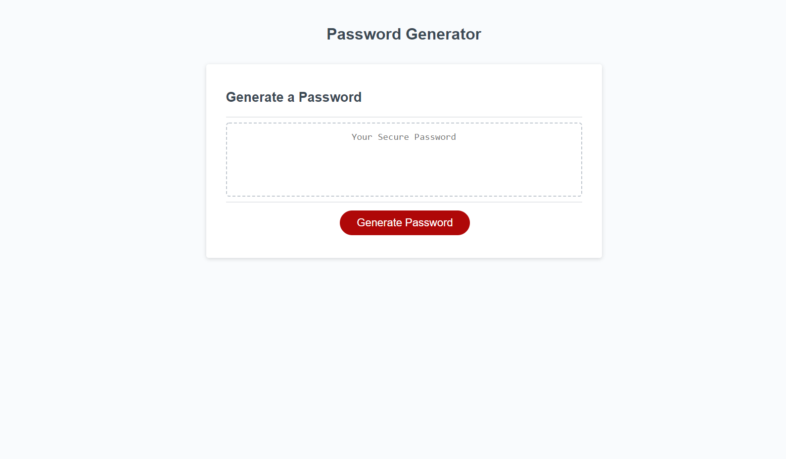
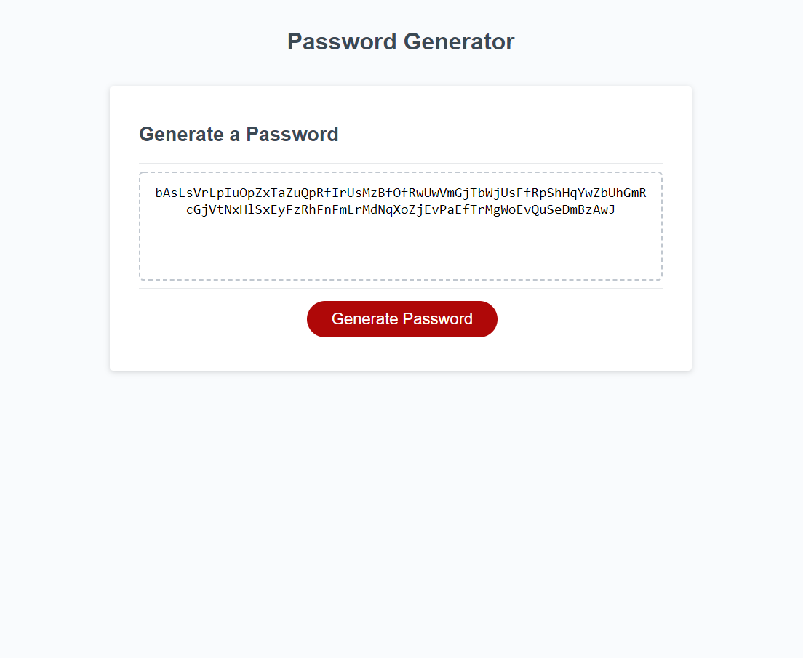
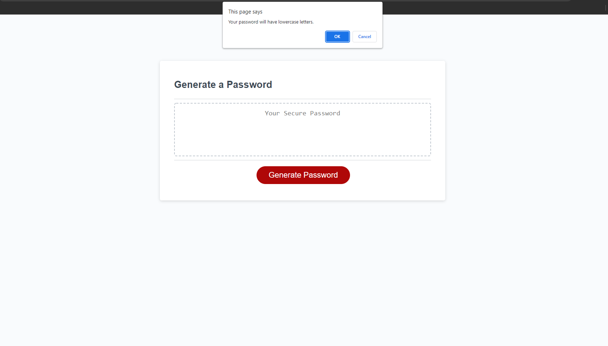
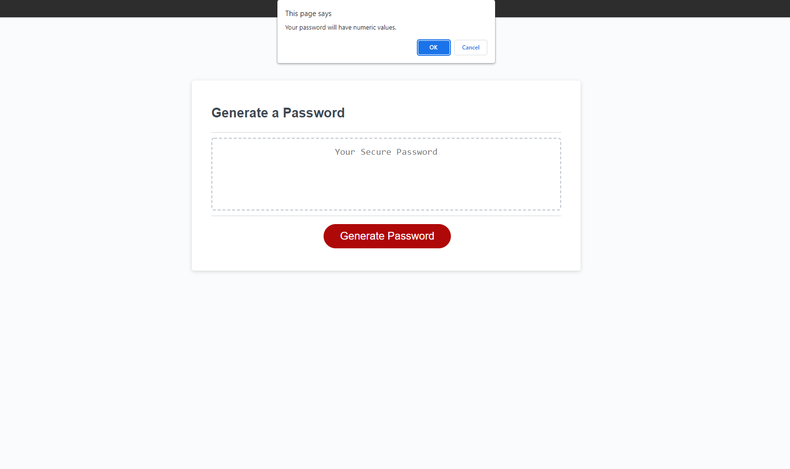
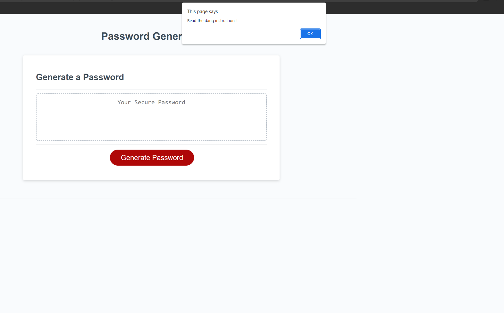

# Password Generator Starter Code

## What is the Password Generator?

The Password Generator is exactly as the name implies a password generator. This application uses HTML, CSS and JavaScript. The application will ask the user a series of prompts after the user clicks the "Generate Password" button on the homescreen. The application will ask the user how many characters they would like their secure password to be (from 8 to 125 characters) and if they would like the password to include lowercase letters, uppercase letters, numbers, and/or special characters. After the user makes their selections a password composed of randomly generated characters will appear in the "Your Secure Password". Please see screenshot below.

### Image of newly generated password

### Screenshots of prompts

----------------------------------------------------------------------------------------------------------------------------------------------------------

The application will not generate a password without the user confirming (by clicking "OK") at least one of the character type specification and will continue to prompt if the user until at least one character type is chosen. 

### Sceenshot of alert shown when no character types are chosen

## Future Enhancements

Currently the passwords generated by this application are 'RANDOM' but there is still room for another level of randomness. Though each of the characters is randomly picking from the available characters in the array (i.e. Lowercase character will randomly select from array containing "abcdefghijklmnopqrstuvwxyz") the order in which the character types appear is uniform. 

For example if the user confirms they want an 8 character password with lowercase, uppercase, and numbers the sequence will be as follows: lower, upper, number, lower, upper, number, lower, upper. This order will persist no matter the length of the password. To rectify this I will be adding a loop that will shuffle where each character is concatenated in the final password output. 

## Try out the PASSWORD GENERATOR!

Give the Password Generator a try [HERE](https://jmarshallmiami.github.io/password-generator/) and make your own secure password today!!!

Check the [gitHub repo](placeholder for gitHub)  to look at the code.

